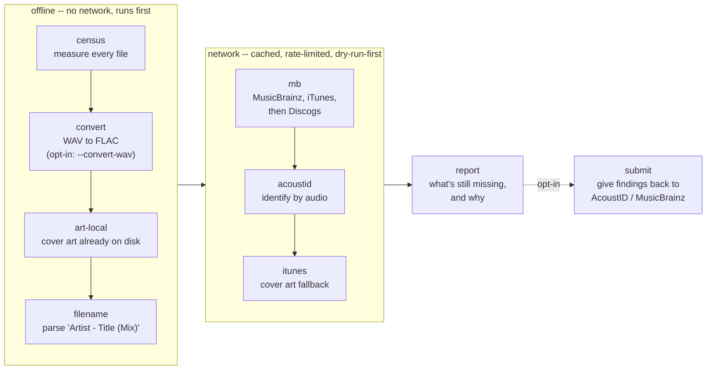
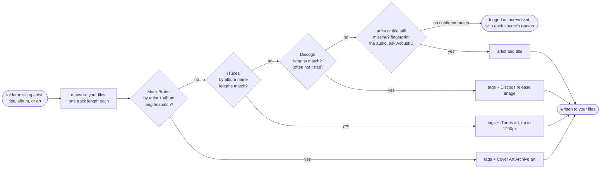

# tagfill

A tool that fills in missing artist, title, album, genre, track number and cover art across a music collection, in place.

**It works album by album**, on a library organised as one folder per release. That's what makes it safe to trust: it doesn't take a match on the strength of a name, it compares every track's length in the folder against the release it found. Loose single tracks aren't its job — they fall back to reading the filename and fingerprinting the audio.

It doesn't do the matching itself. It asks these four, through their own official APIs:

| Source | Used for | Needs an account? |
| --- | --- | --- |
| [MusicBrainz](https://musicbrainz.org) | tags + cover art, tried first | No — just an email address in the config |
| [iTunes](https://performance-partners.apple.com/search-api) | tags + cover art, when MusicBrainz has no match | No |
| [Discogs](https://www.discogs.com/developers) | tags + cover art, last resort | No |
| [AcoustID](https://acoustid.org) | identifies a track by its audio when nothing else can | Yes — a [free API key](https://acoustid.org/new-application) |

**Try it, risk-free:** `tagfill --music-dir /path/to/music --report` prints a read-only report on the state of your library.

```text
tagfill report for /home/you/Music
================================================================================
6 files tracked

Stage activity
--------------
  (no stages have run yet)

Unresolved: 5 file(s) -> report/unresolved.csv
  path                                    missing                 tried
  --------------------------------------  ----------------------  ------
  Portishead - Dummy/01 Track 1.mp3       art                     (none)
  Portishead - Dummy/02 Track 2.mp3       art                     (none)
  Portishead - Dummy/03 Track 3.mp3       art                     (none)
  Unsorted/Massive Attack - Teardrop.mp3  artist+title+album+art  (none)
  Unsorted/unknown track.mp3              artist+title+album+art  (none)

Reacquire (zero-byte/unreadable): 1 file(s) -> report/reacquire.csv
  path                 issue
  -------------------  ---------
  Unsorted/broken.mp3  zero-byte
```

`tried` fills in once stages have run, showing which sources looked at a file and why each one declined. After a pass with `--apply`, the report also gains a table of what got fixed and the percentage.

Nothing is ever written until you add `--apply` — and treat that the way you'd treat any tool that edits files you care about. Do a dry run first, read what it plans to do, then run it again with `--backup-tags` so every change can be undone.

## What it expects

One folder per release:

```text
Music/
├── Portishead - Dummy/
│   ├── 01 Mysterons.flac
│   ├── 02 Sour Times.flac
│   ├── 03 Strangers.flac
│   └── cover.jpg
├── Nirvana - In Utero/
│   ├── 01 Serve the Servants.mp3
│   ├── 02 Scentless Apprentice.mp3
│   └── Scans/
│       └── front.png
└── Unsorted/
    └── some stray track.mp3        ← filename + fingerprint only, no album lookup
```

Folder names aren't parsed — the album lookup matches on the tags and track lengths inside the files, so a folder can be called anything. Filenames matter in two places only: untagged files get `Artist - Title` read off the name, and a track number is written only when the files already sort into track order.

Formats it reads and writes:

| | Formats | Tags live in |
| --- | --- | --- |
| Lossy | `.mp3`, `.ogg`, `.opus`, `.m4a`, `.mp4` | ID3v2, Vorbis comments, MP4 atoms |
| Lossless | `.flac`, `.wav`, `.aiff`, `.aif`, `.aifc` | Vorbis comments, ID3v2 |
| DSD | `.dsf`, `.dff` | ID3v2 |

Every one of them is covered by the same test matrix, so support is exercised rather than assumed. DSD files are tagged in place like anything else and never converted — the WAV-to-FLAC step only ever touches `.wav`.

Anything that isn't audio is ignored, so `.nfo`, `.cue`, `.m3u`, `.log`, `.txt` and `.pdf` files sitting alongside your music are harmless. Images are the exception: one named `cover`, `folder` or `front`, or a lone image in the folder, gets used as cover art, and a `Cover/`, `Scans/` or `Artwork/` subfolder one level down is searched too. A file with an audio extension that turns out not to be audio is listed for re-download rather than crashing the run, and never written to.

## What it touches

tagfill only ever edits the metadata inside your audio files — the tags a music player reads, and the embedded cover art. It never renames a file, moves it, or reorganizes your folders.

**Every write is atomic, undo included.** Each edit is made to a copy alongside the original, flushed to disk, then swapped in with `os.replace()` — atomic on Linux and on Windows. Pull the power mid-write and you get either the untouched original or the finished new version, never a half-written file. That matters because the underlying tag library edits in place: adding a cover to an MP3 rewrites the whole file to make room, so an interrupted write there would corrupt the track outright.

`tagfill restore` goes through the same path, so an interrupted undo can't damage a file either. One caveat worth stating plainly: restoring a single file can take up to three of those writes (fields, cleared fields, art), each atomic on its own but not as a group. Interrupt it and the audio is always intact — you may just have to re-run `restore` to finish putting the tags back.

| Action | Does tagfill do it? |
| --- | --- |
| Fill in a missing tag (artist, title, album, genre, track #) | Yes, only once it finds a verified match |
| Embed cover art | Yes, only when missing or too small |
| Convert a WAV to FLAC | Only if you ask for it (`--convert-wav`) |
| Overwrite a tag that already has a value | No, unless you pass `--overwrite` |
| Rename a file | Never |
| Move a file | Never |
| Delete a file | Never — originals from a conversion go to a quarantine folder, not the trash |
| Reorganize your folders | Never |

**Known limitations:** beyond the one-folder-per-release expectation above, a folder holding several albums at once is read as a single compilation and will usually just fail to match rather than being split apart; tracks nobody has catalogued stay unresolved rather than being guessed at; and zero-byte or unreadable files are listed for re-download, since there's nothing in them to repair.

## Pipeline



`tagfill run` does all of it in order. You can also run any single step on its own, by name — the report is the one exception, it's a flag rather than a step:

| Stage | What it does |
| --- | --- |
| `census` | measures every file — what's missing, what's already fine |
| `convert` | WAV to FLAC, so there's somewhere to put tags (opt-in) |
| `art-local` | embeds cover art already sitting on your disk |
| `filename` | reads `Artist - Title (Mix)` out of the filename |
| `mb` | the online lookup: MusicBrainz, then iTunes, then Discogs |
| `acoustid` | identifies a track by its audio when the rest came up empty |
| `itunes` | one more pass for cover art only |
| `--report` | what's still missing, and which sources declined it |
| `submit` | opt-in: contribute what you found back upstream |

So `tagfill art-local --apply` embeds cover art from your disk and does nothing else. Two flags help while you're trying things out: `--path 'Some/Subtree'` limits a run to one folder inside your library (keep the quotes if the name has spaces), and `--limit 50` stops after 50 targets so you can see what happens before letting it loose on everything. A target is a file for most stages, and a folder for the ones that work an album at a time (`mb`, `itunes`), since an album is only worth looking up once.

## How a missing tag or cover gets found

The `mb` stage is where most of the real matching happens. Each source is asked in turn, and the first one whose track lengths match your files wins:



tagfill never trusts a match just because the name looks right — before writing anything, it checks that the album's track lengths actually match your files, which is what stops it from tagging your music with the wrong edition of an album, or a different album that just happens to share a name. It only fills in the track number when it's sure the files are already in the right order; if it can't be sure, that field is left blank rather than guessed. Cover art is looked for on your own disk first — a `cover.jpg` or `cover.png` already sitting next to your music — before tagfill goes looking online.

You choose which metadata gets pulled from these online sources. Genre and track number are on by default; drop either from the list to leave that tag untouched, or set it to `[]` to fetch only the core artist/title/album fields:

```toml
[collection]
extra_tags = ["genre", "tracknumber"]
```

## Install

### Linux

```text
git clone https://github.com/Strykar/tagfill
cd tagfill
python -m venv .venv
source .venv/bin/activate
pip install -e '.[network]'
```

That installs the `tagfill` command plus its Python libraries:

| Library | For |
| --- | --- |
| [mutagen](https://pypi.org/project/mutagen/) | reading and writing tags |
| [requests](https://pypi.org/project/requests/) | talking to the APIs |
| [musicbrainzngs](https://pypi.org/project/musicbrainzngs/) | the MusicBrainz client |
| [pillow](https://pypi.org/project/pillow/) | checking cover art dimensions |

You will also need these tools, available via package managers like `apt` and `pacman`:

| Tool | For |
| --- | --- |
| [ffmpeg](https://ffmpeg.org/download.html) | WAV to FLAC conversion, and verifying it |
| [flac](https://xiph.org/flac/download.html) | WAV to FLAC conversion |
| [chromaprint](https://acoustid.org/chromaprint) (`fpcalc`) | fingerprinting audio for AcoustID |

### Windows

**Download [tagfill.exe](https://github.com/Strykar/tagfill/releases/latest).** No Python needed — the libraries above are bundled inside it. Put it in a folder of its own, say `C:\tagfill`.

Or, if you already have Python and Git:

```text
git clone https://github.com/Strykar/tagfill
cd tagfill
py -m venv .venv
.venv\Scripts\activate
pip install -e ".[network]"
```

The command-line tools are separate either way. Download each one and put its `.exe` in that same folder next to `tagfill.exe`, so Windows finds it:

| Tool | For |
| --- | --- |
| [ffmpeg](https://ffmpeg.org/download.html) | WAV to FLAC conversion, and verifying it (Windows builds are linked from that page; ffmpeg ships no official Windows binary of its own) |
| [flac](https://xiph.org/flac/download.html) | WAV to FLAC conversion |
| [chromaprint](https://acoustid.org/chromaprint) (`fpcalc.exe`) | fingerprinting audio for AcoustID |

## Run it

**Read-only, no setup needed:**

```text
tagfill --music-dir /path/to/music --report
```

**Want more control** — thresholds, crate folders, anything beyond the defaults? Set up a config file:

```text
tagfill init                    # writes tagfill.toml
$EDITOR tagfill.toml            # set [collection].root at minimum
```

## Configuration

```toml
[collection]
root = "~/Music"
extra_tags = ["genre", "tracknumber"]   # set [] to only ever touch the core fields

[musicbrainz]
contact = "you@example.org"   # the mb stage won't run anonymously; MB policy

[acoustid]
api_key = ""                  # or $ACOUSTID_API_KEY, or key_file

# playlist-style folders of other artists' tracks
[crates]
globs = ["DJ Pool/*"]
```

`tagfill init` writes the full commented example.

## Write ops

Once a dry run looks right:

```text
tagfill run                          # dry run
tagfill run --apply --backup-tags
tagfill run --convert-wav --apply
tagfill --report
```

**One stage instead of the full pipeline:**

```text
tagfill mb --apply --backup-tags --limit 50
```

**Low-confidence filename guesses go to a review queue, not into your files.** Edit the `accept` column in the `report/review-queue.csv` the report points you at, then:

```text
tagfill filename --from-review /path/to/review-queue.csv --apply
```

**Undo:**

```text
tagfill restore                              # every touched file back
tagfill restore --only 'Path/To/One File.mp3'
```

Everything tagfill produces — journal, census, reports, HTTP caches, backups, quarantined originals — lives in one workdir, never scattered through your collection. By default that's your per-user state directory (`~/.local/state/tagfill` on Linux, `%LOCALAPPDATA%\tagfill` on Windows); set `[collection].workdir` to put it anywhere else.
